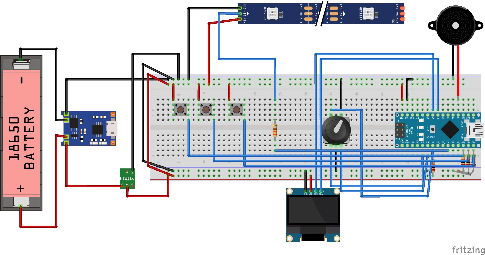

# Peltzman effect / Pseudocertainty box

The user is presented with a box containing 7 RGB LEDs and three buttons all corresponding to a color (a button labeled RED, GREEN, and BLUE). The box offers three levels of gameplay. The goal of the user is to guess which color will light up next. The user will be required to press a button corresponding to the color he/she thinks will light up next in the sequence. Upon pressing a button the next LED in the sequence will light up, if the user input was correct it will signal for the next input, however, if the input is wrong it will reset the game. There is not succession through levels, the goal is for the user to acquire a sense of pattern and describe it, which might lead to pseudo-certainty.

On the first level, the game will present a recurring pattern of using only two colors and always map in 3+4 pattern. (RRRGGGG, GGGRRRR, …)

On the second level, the game will use all three colors for the sequence and present the user with a mixed 2-3-2, 2-2-3, 3-2-2 pattern.

On the third level the sequence will be entirely random using all three colors.

For more information see

https://en.wikipedia.org/wiki/Risk_compensation#Peltzman_effect,
https://en.wikipedia.org/wiki/Pseudocertainty_effect

## Concept

## BOM

| Part | Qty |
| --- | --- |
| Arduino Nano| 1 |
| WS2812B adressible LED | 7 |
| SSD1306 OLED display | 1 |
| EC11 Rotary Encoder with push button | 1 |
| Buzzer | 1 |
| Tactile buttons | 3 |
| 20kΩ 1/4W resistor | 4 |
| 330Ω 1/4W resistor | 1 |
| TP4056 charger module | 1 |
| 18650 battery module | 1 |
| DC-DC step-up 5V boost converter module | 1 |

## Wiring scheme

