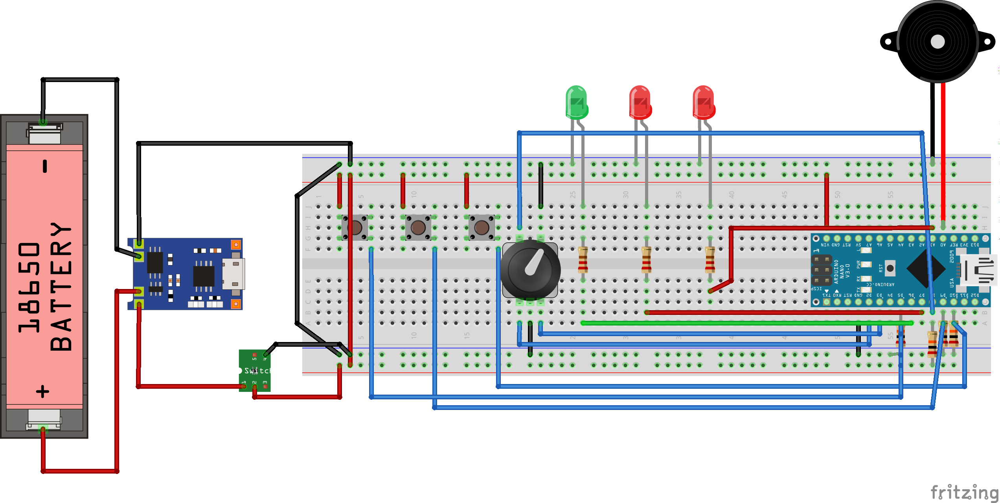

# Salience bias box

The user is presented with a box with seemingly random number of buttons and elements.
One element is a button that is heart shaped, one is labeled with a skull and bones
icon, and others are of different shapes and colors. Some elements will produce
side-effects like sound, other will do nothing.

The task for the user would be to test the salience effect premise - will the user
assign more values to buttons that look “more important” like the kill button,
buttons that are larger, buttons that produce side-effects like sound, or those
who do absolutely nothing. Another possible route for user experiments is to test users
conviction that the button importance is valid even if no side-effects are produced.

For more information see https://en.wikipedia.org/wiki/Salience_(neuroscience)

## BOM

| Part | Qty |
| --- | --- |
| Arduino Nano| 1 |
| EC11 Rotary Encoder with push button | 1 |
| Tactile buttons | 3 |
| LED (green) | 1 |
| LED (red) | 2 |
| Buzzer | 1 |
| 220Ω 1/4W resistor | 3 |
| 20kΩ 1/4W resistor | 4 |

## Wiring diagram

