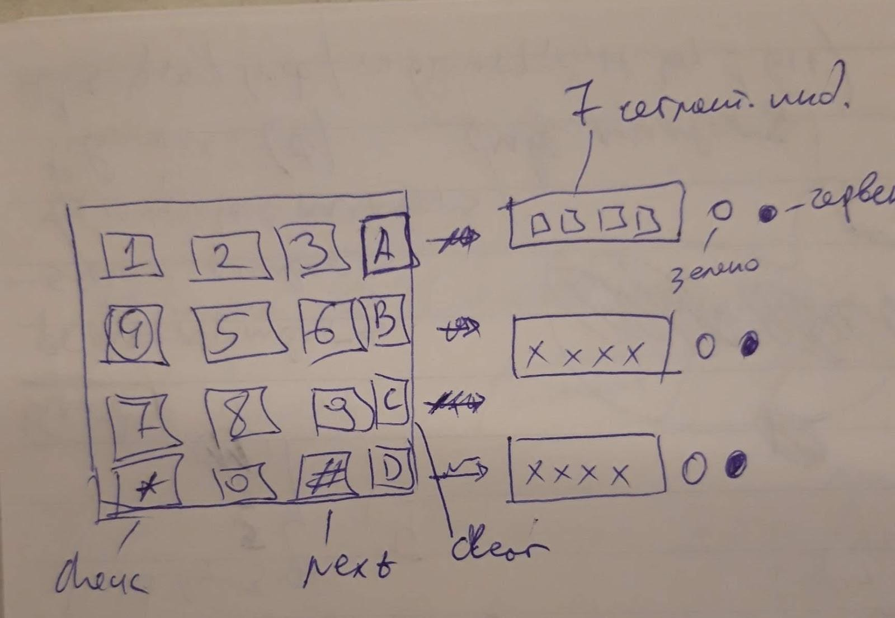
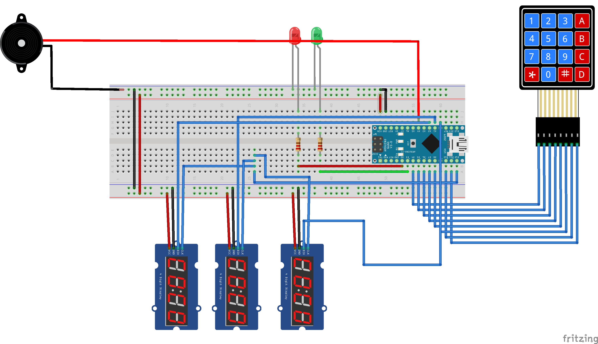

# Wason 2-4-6 box

This box is based on the
[2-4-6 test by Peter Wason](https://en.wikipedia.org/wiki/Peter_Cathcart_Wason#Wason_and_the_2-4-6_Task).
It shows that people are not logical creatures - they are emotional.
The box also shows confirmation bias, that is the majority of people are making
a hypothesis and more often try to confirm it instead of disproving it.

In software testing, testers should be examining systems under test (SUT) from
different points of views and also trying to examine SUT in different way
(e.g. negative scenario, positive scenario). A hardware box implementing the
experiment is a fun way to demonstrate the concept!

## BOM

| Part | Qty |
| --- | --- |
| Arduino Nano| 1 |
| 4X4 Matrix keypad | 1 |
| TM1637 display | 3 |
| LED (green) | 1 |
| LED (red) | 1 |
| Buzzer | 1 |
| 220Ω 1/4W resistor | 2 |
| TP 4056 charger module | 1 |
| 18650 battery module | 1 |
| DC-DC step-up 5V boost converter module | 1 |

## Wiring scheme

